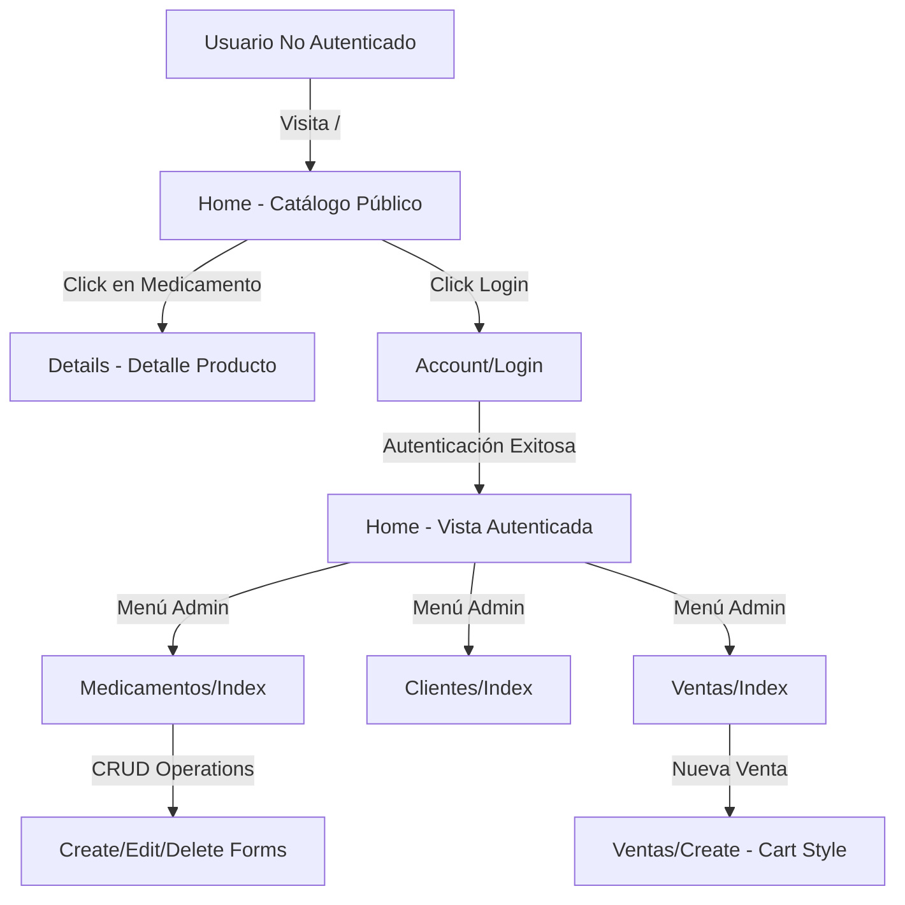

# Design Document

## Overview

Este documento describe el diseño técnico para integrar el template Bootstrap "pharma-master" en la aplicación ASP.NET Core MVC WebFarmacia. La integración se realizará modificando únicamente las vistas y assets estáticos, preservando completamente la lógica de negocio, controladores y modelos existentes.

La estrategia principal es adaptar el _Layout.cshtml para usar la estructura HTML del template pharma-master, migrar todos los assets estáticos (CSS, JS, fonts, images) al directorio wwwroot, y crear vistas Razor que combinen la funcionalidad existente con el diseño visual del template.

## Architecture

### High-Level Architecture

```
WebFarmacia (ASP.NET Core MVC)
│
├── Controllers/ (Sin cambios)
│   ├── HomeController
│   ├── MedicamentosController
│   ├── ClientesController
│   ├── VentasController
│   └── AccountController
│
├── Models/ (Sin cambios)
│   ├── FarmaciaContext
│   ├── Medicamento
│   ├── Cliente
│   └── Venta
│
├── Views/ (Modificadas con pharma-master styling)
│   ├── Shared/
│   │   └── _Layout.cshtml (Integra pharma-master navbar/footer)
│   ├── Home/
│   │   └── Index.cshtml (Hero + catálogo público)
│   ├── Medicamentos/
│   │   ├── Index.cshtml (Grid estilo shop.html)
│   │   ├── Details.cshtml (Estilo shop-single.html)
│   │   └── Create/Edit.cshtml (Forms con pharma styling)
│   └── Ventas/
│       └── Create.cshtml (Interfaz estilo cart.html)
│
└── wwwroot/ (Assets de pharma-master)
    ├── css/
    │   ├── bootstrap.min.css
    │   ├── style.css (pharma-master)
    │   └── [otros CSS del template]
    ├── js/
    │   ├── jquery-3.3.1.min.js
    │   ├── bootstrap.min.js
    │   ├── main.js (pharma-master)
    │   └── [otros JS del template]
    ├── fonts/
    │   └── icomoon/
    └── images/
        └── [imágenes del template]
```

### Navigation Flow



## Components and Interfaces

### 1. Layout Component (_Layout.cshtml)

**Responsabilidad**: Proporcionar la estructura HTML común para todas las páginas usando el diseño de pharma-master.

**Estructura**:
```html
<!DOCTYPE html>
<html lang="es">
<head>
    <!-- Meta tags -->
    <!-- Google Fonts: Rubik, Crimson Text -->
    <!-- pharma-master CSS -->
    <link rel="stylesheet" href="~/fonts/icomoon/style.css">
    <link rel="stylesheet" href="~/css/bootstrap.min.css">
    <link rel="stylesheet" href="~/css/owl.carousel.min.css">
    <link rel="stylesheet" href="~/css/aos.css">
    <link rel="stylesheet" href="~/css/style.css">
</head>
<body>
    <div class="site-wrap">
        <!-- Navigation Bar -->
        <div class="site-navbar py-2">
            <div class="container">
                <!-- Logo -->
                <div class="logo">
                    <a asp-controller="Home" asp-action="Index">Farmacia</a>
                </div>
                
                <!-- Navigation Menu (Conditional) -->
                <nav class="site-navigation">
                    <ul class="site-menu">
                        @if (User.Identity?.IsAuthenticated == true)
                        {
                            <!-- Admin Menu -->
                            <li><a asp-controller="Medicamentos" asp-action="Index">Medicamentos</a></li>
                            <li><a asp-controller="Clientes" asp-action="Index">Clientes</a></li>
                            <li><a asp-controller="Empleados" asp-action="Index">Empleados</a></li>
                            <li><a asp-controller="Categorias" asp-action="Index">Categorías</a></li>
                            <li><a asp-controller="Ventas" asp-action="Index">Ventas</a></li>
                        }
                        else
                        {
                            <!-- Public Menu -->
                            <li><a asp-controller="Home" asp-action="Index">Inicio</a></li>
                            <li><a asp-controller="Home" asp-action="Catalogo">Catálogo</a></li>
                        }
                    </ul>
                </nav>
                
                <!-- User Options -->
                <div class="icons">
                    @if (User.Identity?.IsAuthenticated == true)
                    {
                        <span>@User.Identity.Name</span>
                        <form asp-controller="Account" asp-action="Logout" method="post">
                            <button type="submit" class="btn btn-primary">Cerrar Sesión</button>
                        </form>
                    }
                    else
                    {
                        <a asp-controller="Account" asp-action="Login" class="btn btn-primary">
                            Iniciar Sesión
                        </a>
                    }
                </div>
            </div>
        </div>
        
        <!-- Main Content -->
        @RenderBody()
        
        <!-- Footer -->
        <footer class="site-footer">
            <div class="container">
                <div class="row">
                    <div class="col-md-4">
                        <h3 class="footer-heading">Sobre Nosotros</h3>
                        <p>Sistema de gestión de farmacia</p>
                    </div>
                    <div class="col-md-4">
                        <h3 class="footer-heading">Enlaces Rápidos</h3>
                        <ul class="list-unstyled">
                            <li><a asp-controller="Home" asp-action="Index">Inicio</a></li>
                            <li><a asp-controller="Home" asp-action="Catalogo">Catálogo</a></li>
                        </ul>
                    </div>
                    <div class="col-md-4">
                        <h3 class="footer-heading">Contacto</h3>
                        <p>Información de contacto</p>
                    </div>
                </div>
            </div>
        </footer>
    </div>
    
    <!-- pharma-master JavaScript -->
    <script src="~/js/jquery-3.3.1.min.js"></script>
    <script src="~/js/popper.min.js"></script>
    <script src="~/js/bootstrap.min.js"></script>
    <script src="~/js/owl.carousel.min.js"></script>
    <script src="~/js/aos.js"></script>
    <script src="~/js/main.js"></script>
    
    @await RenderSectionAsync("Scripts", required: false)
</body>
</html>
```

### 2. Home Index View (Public Catalog)

**Responsabilidad**: Mostrar página de inicio con hero section y catálogo de medicamentos para usuarios no autenticados.

**Componentes**:
- Hero Section: Banner principal con imagen de fondo y call-to-action
- Featured Products: Grid de medicamentos destacados (3 columnas)
- Product Cards: Tarjetas con imagen, nombre, precio y botón "Ver Detalles"

**Datos**:
```csharp
// HomeController.cs
public async Task<IActionResult> Index()
{
    var medicamentos = await _context.Medicamentos
        .Include(m => m.Categoria)
        .Where(m => m.Stock > 0)
        .Take(6)
        .ToListAsync();
    
    return View(medicamentos);
}
```

**Vista**:
```html
<!-- Hero Section -->
<div class="site-blocks-cover" style="background-image: url('~/images/hero_1.jpg');">
    <div class="container">
        <div class="row">
            <div class="col-lg-7 mx-auto text-center">
                <h2 class="sub-title">Medicamentos de Calidad</h2>
                <h1>Bienvenido a Farmacia</h1>
                <p>
                    <a asp-controller="Home" asp-action="Catalogo" class="btn btn-primary px-5 py-3">
                        Ver Catálogo
                    </a>
                </p>
            </div>
        </div>
    </div>
</div>

<!-- Products Section -->
<div class="site-section">
    <div class="container">
        <div class="row">
            <div class="title-section text-center col-12">
                <h2 class="text-uppercase">Productos Destacados</h2>
            </div>
        </div>
        <div class="row">
            @foreach (var medicamento in Model)
            {
                <div class="col-sm-6 col-lg-4 text-center item mb-4">
                    <a asp-controller="Medicamentos" asp-action="Details" asp-route-id="@medicamento.IdMedicamento">
                        
                    </a>
                    <h3 class="text-dark">
                        <a asp-controller="Medicamentos" asp-action="Details" asp-route-id="@medicamento.IdMedicamento">
                            @medicamento.Nombre
                        </a>
                    </h3>
                    <p class="price">$@medicamento.Precio.ToString("N2")</p>
                </div>
            }
        </div>
    </div>
</div>
```

### 3. Medicamentos Index View (Admin)

**Responsabilidad**: Listar todos los medicamentos en formato de tabla o grid para administradores autenticados.

**Diseño**: Combinar tabla Bootstrap con estilos pharma-master para mantener funcionalidad CRUD.

**Vista**:
```html
<div class="site-section">
    <div class="container">
        <div class="row mb-4">
            <div class="col-12">
                <h2 class="text-uppercase">Gestión de Medicamentos</h2>
                <a asp-action="Create" class="btn btn-primary">Nuevo Medicamento</a>
            </div>
        </div>
        
        <div class="row">
            <div class="col-12">
                <table class="table table-striped">
                    <thead>
                        <tr>
                            <th>Nombre</th>
                            <th>Precio</th>
                            <th>Stock</th>
                            <th>Categoría</th>
                            <th>Acciones</th>
                        </tr>
                    </thead>
                    <tbody>
                        @foreach (var item in Model)
                        {
                            <tr>
                                <td>@item.Nombre</td>
                                <td>$@item.Precio.ToString("N2")</td>
                                <td>@item.Stock</td>
                                <td>@item.Categoria?.Nombre</td>
                                <td>
                                    <a asp-action="Edit" asp-route-id="@item.IdMedicamento" class="btn btn-sm btn-primary">Editar</a>
                                    <a asp-action="Details" asp-route-id="@item.IdMedicamento" class="btn btn-sm btn-secondary">Detalles</a>
                                    <a asp-action="Delete" asp-route-id="@item.IdMedicamento" class="btn btn-sm btn-danger">Eliminar</a>
                                </td>
                            </tr>
                        }
                    </tbody>
                </table>
            </div>
        </div>
    </div>
</div>
```

### 4. Medicamentos Details View (Product Detail)

**Responsabilidad**: Mostrar detalles completos de un medicamento usando el diseño de shop-single.html.

**Componentes**:
- Breadcrumb navigation
- Product image gallery
- Product information (nombre, precio, descripción, stock)
- Specifications table

**Vista**:
```html
<!-- Breadcrumb -->
<div class="bg-light py-3">
    <div class="container">
        <div class="row">
            <div class="col-md-12 mb-0">
                <a asp-controller="Home" asp-action="Index">Inicio</a> 
                <span class="mx-2 mb-0">/</span>
                <a asp-controller="Home" asp-action="Catalogo">Catálogo</a>
                <span class="mx-2 mb-0">/</span>
                <strong class="text-black">@Model.Nombre</strong>
            </div>
        </div>
    </div>
</div>

<!-- Product Detail -->
<div class="site-section">
    <div class="container">
        <div class="row">
            <div class="col-md-6">
                
            </div>
            <div class="col-md-6">
                <h2 class="text-black">@Model.Nombre</h2>
                <p class="mb-4">@Model.Descripcion</p>
                <p><strong class="text-primary h4">$@Model.Precio.ToString("N2")</strong></p>
                
                <div class="mb-5">
                    <div class="row">
                        <div class="col-md-6">
                            <strong>Categoría:</strong> @Model.Categoria?.Nombre
                        </div>
                        <div class="col-md-6">
                            <strong>Stock:</strong> @Model.Stock unidades
                        </div>
                    </div>
                    <div class="row mt-2">
                        <div class="col-md-6">
                            <strong>Laboratorio:</strong> @Model.Laboratorio?.Nombre
                        </div>
                        <div class="col-md-6">
                            <strong>Fecha Vencimiento:</strong> @Model.FechaVencimiento?.ToString("dd/MM/yyyy")
                        </div>
                    </div>
                </div>
                
                @if (User.Identity?.IsAuthenticated == true)
                {
                    <p>
                        <a asp-action="Edit" asp-route-id="@Model.IdMedicamento" class="btn btn-primary">Editar</a>
                        <a asp-action="Index" class="btn btn-secondary">Volver al Listado</a>
                    </p>
                }
            </div>
        </div>
    </div>
</div>
```

### 5. Ventas Create View (Cart-Style Interface)

**Responsabilidad**: Proporcionar interfaz de carrito de compras para crear nuevas ventas.

**Componentes**:
- Cliente selection dropdown
- Medicamento search/selection
- Cart table con items seleccionados
- Quantity controls
- Total calculation
- Checkout button

**Datos**:
```csharp
// VentasController.cs
public class VentaViewModel
{
    public int IdCliente { get; set; }
    public List<DetalleVentaItem> Items { get; set; } = new();
    public decimal Total => Items.Sum(i => i.Subtotal);
}

public class DetalleVentaItem
{
    public int IdMedicamento { get; set; }
    public string NombreMedicamento { get; set; }
    public int Cantidad { get; set; }
    public decimal PrecioUnitario { get; set; }
    public decimal Subtotal => Cantidad * PrecioUnitario;
}
```

**Vista**:
```html
<div class="site-section">
    <div class="container">
        <div class="row mb-5">
            <div class="col-md-12">
                <h2 class="text-black">Nueva Venta</h2>
            </div>
        </div>
        
        <form asp-action="Create" method="post">
            <!-- Cliente Selection -->
            <div class="row mb-4">
                <div class="col-md-6">
                    <label asp-for="IdCliente" class="text-black">Cliente</label>
                    <select asp-for="IdCliente" class="form-control" asp-items="ViewBag.Clientes"></select>
                </div>
            </div>
            
            <!-- Add Product Section -->
            <div class="row mb-4">
                <div class="col-md-12">
                    <h4>Agregar Medicamentos</h4>
                    <div class="row">
                        <div class="col-md-6">
                            <select id="medicamentoSelect" class="form-control">
                                <option value="">Seleccionar medicamento...</option>
                                @foreach (var med in ViewBag.Medicamentos)
                                {
                                    <option value="@med.Value" data-precio="@med.Precio">@med.Text</option>
                                }
                            </select>
                        </div>
                        <div class="col-md-3">
                            <input type="number" id="cantidadInput" class="form-control" placeholder="Cantidad" min="1" value="1">
                        </div>
                        <div class="col-md-3">
                            <button type="button" id="btnAgregar" class="btn btn-primary btn-block">Agregar</button>
                        </div>
                    </div>
                </div>
            </div>
            
            <!-- Cart Table -->
            <div class="row mb-5">
                <div class="col-md-12">
                    <div class="site-blocks-table">
                        <table class="table table-bordered">
                            <thead>
                                <tr>
                                    <th>Medicamento</th>
                                    <th>Precio</th>
                                    <th>Cantidad</th>
                                    <th>Subtotal</th>
                                    <th>Eliminar</th>
                                </tr>
                            </thead>
                            <tbody id="cartItems">
                                <!-- Items agregados dinámicamente con JavaScript -->
                            </tbody>
                        </table>
                    </div>
                </div>
            </div>
            
            <!-- Total Section -->
            <div class="row">
                <div class="col-md-6 ml-auto">
                    <div class="row mb-5">
                        <div class="col-md-6">
                            <span class="text-black h4">Total</span>
                        </div>
                        <div class="col-md-6 text-right">
                            <strong class="text-black h4" id="totalAmount">$0.00</strong>
                        </div>
                    </div>
                    <div class="row">
                        <div class="col-md-12">
                            <button type="submit" class="btn btn-primary btn-lg btn-block">
                                Completar Venta
                            </button>
                            <a asp-action="Index" class="btn btn-secondary btn-lg btn-block">
                                Cancelar
                            </a>
                        </div>
                    </div>
                </div>
            </div>
        </form>
    </div>
</div>

@section Scripts {
    <script>
        // JavaScript para manejar el carrito dinámicamente
        let cartItems = [];
        
        document.getElementById('btnAgregar').addEventListener('click', function() {
            // Lógica para agregar items al carrito
        });
        
        function updateTotal() {
            // Calcular y actualizar el total
        }
    </script>
}
```

### 6. Form Views (Create/Edit)

**Responsabilidad**: Proporcionar formularios estilizados para operaciones CRUD.

**Diseño**: Usar clases de formulario de Bootstrap con estilos pharma-master.

**Estructura Común**:
```html
<div class="site-section">
    <div class="container">
        <div class="row">
            <div class="col-md-8 mx-auto">
                <h2 class="text-black mb-4">@ViewData["Title"]</h2>
                
                <form asp-action="Create" method="post">
                    <div asp-validation-summary="ModelOnly" class="text-danger"></div>
                    
                    <div class="form-group">
                        <label asp-for="Nombre" class="text-black"></label>
                        <input asp-for="Nombre" class="form-control" />
                        <span asp-validation-for="Nombre" class="text-danger"></span>
                    </div>
                    
                    <!-- Más campos del formulario -->
                    
                    <div class="form-group">
                        <button type="submit" class="btn btn-primary">Guardar</button>
                        <a asp-action="Index" class="btn btn-secondary">Cancelar</a>
                    </div>
                </form>
            </div>
        </div>
    </div>
</div>
```

## Data Models

No se requieren cambios en los modelos existentes. Los modelos actuales (Medicamento, Cliente, Venta, DetalleVenta, etc.) se mantienen sin modificaciones.

**Modelos Existentes a Utilizar**:
- `Medicamento`: Datos de productos para catálogo
- `Cliente`: Información de clientes para ventas
- `Venta`: Registro de transacciones
- `DetalleVenta`: Items individuales de cada venta
- `Categoria`: Clasificación de medicamentos
- `Laboratorio`: Fabricantes de medicamentos

**Nuevo ViewModel (opcional)**:
```csharp
// Para la vista de creación de ventas
public class VentaCreateViewModel
{
    public int IdCliente { get; set; }
    public int IdEmpleado { get; set; }
    public List<DetalleVentaDto> Detalles { get; set; }
    
    public decimal Total => Detalles?.Sum(d => d.Subtotal) ?? 0;
}

public class DetalleVentaDto
{
    public int IdMedicamento { get; set; }
    public string NombreMedicamento { get; set; }
    public int Cantidad { get; set; }
    public decimal PrecioUnitario { get; set; }
    public decimal Subtotal => Cantidad * PrecioUnitario;
}
```

## Error Handling

### Validation Errors

Usar los estilos de alerta de pharma-master para mostrar errores de validación:

```html
@if (!ViewData.ModelState.IsValid)
{
    <div class="alert alert-danger" role="alert">
        <ul class="mb-0">
            @foreach (var error in ViewData.ModelState.Values.SelectMany(v => v.Errors))
            {
                <li>@error.ErrorMessage</li>
            }
        </ul>
    </div>
}
```

### 404 Not Found

Crear vista personalizada con diseño pharma-master:

```html
<div class="site-section">
    <div class="container">
        <div class="row">
            <div class="col-md-12 text-center">
                <h1 class="display-1">404</h1>
                <h2>Página no encontrada</h2>
                <p class="lead">Lo sentimos, la página que buscas no existe.</p>
                <a asp-controller="Home" asp-action="Index" class="btn btn-primary">
                    Volver al Inicio
                </a>
            </div>
        </div>
    </div>
</div>
```

### Database Errors

Manejar errores de base de datos en controladores y mostrar mensajes amigables:

```csharp
try
{
    await _context.SaveChangesAsync();
    return RedirectToAction(nameof(Index));
}
catch (DbUpdateException)
{
    ModelState.AddModelError("", "No se pudo guardar los cambios. Intente nuevamente.");
}
```

## Testing Strategy

### Manual Testing Checklist

1. **Navigation Testing**
   - Verificar que el menú cambia correctamente entre usuario autenticado/no autenticado
   - Probar todos los enlaces del menú
   - Verificar breadcrumbs en páginas de detalle

2. **Responsive Design Testing**
   - Probar en dispositivos móviles (320px, 768px, 1024px, 1920px)
   - Verificar que el menú hamburguesa funciona en móvil
   - Comprobar que las tablas son scrollables en pantallas pequeñas

3. **CRUD Operations Testing**
   - Crear, editar, eliminar medicamentos
   - Verificar que los formularios validan correctamente
   - Comprobar que los mensajes de error se muestran con el estilo correcto

4. **Cart Functionality Testing**
   - Agregar items al carrito de ventas
   - Modificar cantidades
   - Eliminar items
   - Verificar cálculo de totales
   - Completar una venta

5. **Authentication Testing**
   - Login/logout
   - Verificar redirección a login cuando se intenta acceder a páginas protegidas
   - Comprobar que las páginas públicas son accesibles sin autenticación

### Browser Compatibility

Probar en:
- Chrome (última versión)
- Firefox (última versión)
- Edge (última versión)
- Safari (si está disponible)

### Performance Considerations

- Minimizar CSS y JavaScript en producción
- Optimizar imágenes (usar formatos WebP cuando sea posible)
- Implementar lazy loading para imágenes de productos
- Considerar CDN para assets estáticos

## Migration Plan

### Phase 1: Asset Migration
1. Copiar todos los archivos de pharma-master/css a wwwroot/css
2. Copiar todos los archivos de pharma-master/js a wwwroot/js
3. Copiar pharma-master/fonts a wwwroot/fonts
4. Copiar pharma-master/images a wwwroot/images

### Phase 2: Layout Update
1. Actualizar _Layout.cshtml con estructura de pharma-master
2. Actualizar referencias a CSS y JS
3. Implementar navegación condicional (autenticado/no autenticado)

### Phase 3: View Updates
1. Actualizar Home/Index.cshtml (catálogo público)
2. Actualizar Medicamentos/Index.cshtml (lista admin)
3. Actualizar Medicamentos/Details.cshtml (detalle producto)
4. Actualizar formularios Create/Edit
5. Actualizar Ventas/Create.cshtml (interfaz carrito)

### Phase 4: Testing & Refinement
1. Pruebas funcionales completas
2. Ajustes de diseño según necesidad
3. Optimización de rendimiento
4. Documentación de cambios

## Design Decisions

### Decision 1: Preservar Controladores
**Rationale**: Los controladores existentes contienen lógica de negocio validada. Modificar solo las vistas minimiza el riesgo de introducir bugs.

### Decision 2: Usar pharma-master CSS sin modificaciones
**Rationale**: Mantener el CSS original del template asegura que todos los componentes visuales funcionen correctamente. Personalizaciones se harán mediante CSS adicional si es necesario.

### Decision 3: Implementar Catálogo Público
**Rationale**: Permite a usuarios no autenticados explorar productos, mejorando la experiencia de usuario y potencialmente aumentando el engagement.

### Decision 4: Interfaz de Carrito para Ventas
**Rationale**: La interfaz de carrito es más intuitiva que un formulario tradicional para agregar múltiples items a una venta.

### Decision 5: Mantener Autenticación Existente
**Rationale**: El sistema de autenticación con cookies funciona correctamente. No hay necesidad de cambiarlo.
